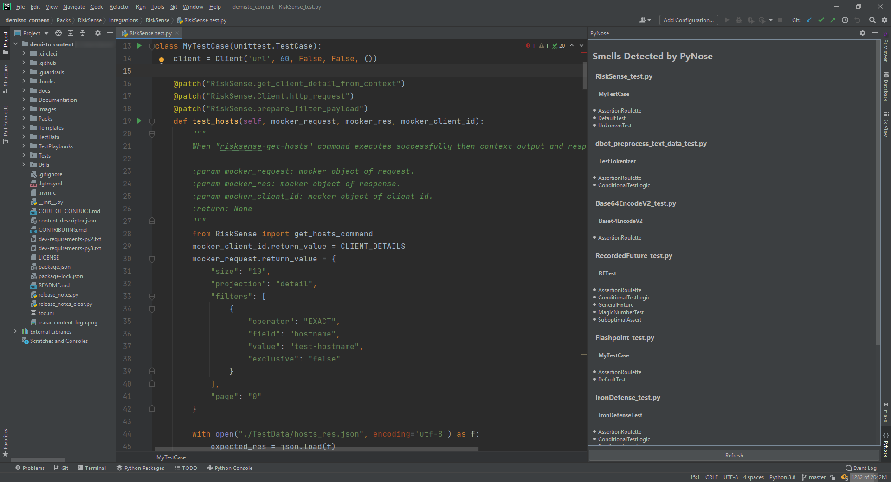
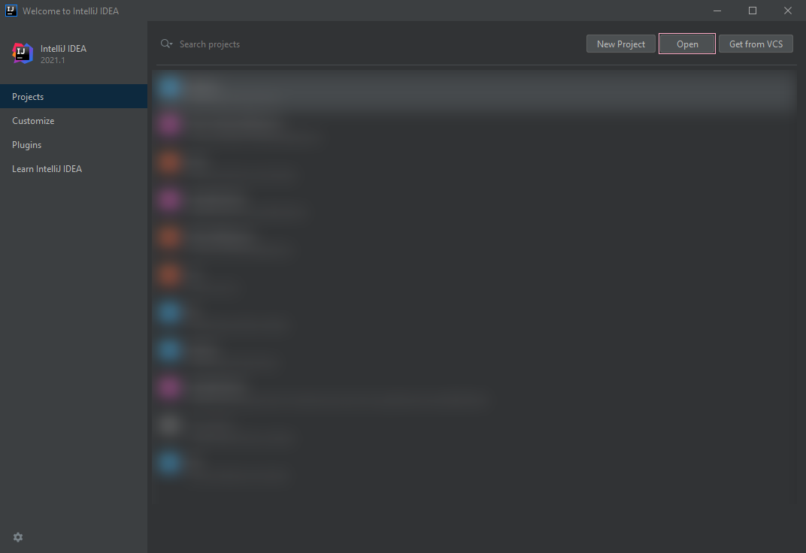
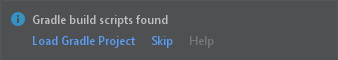
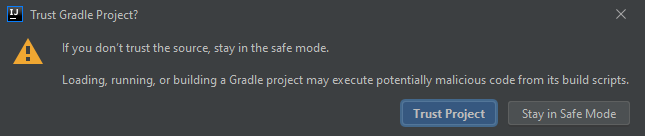
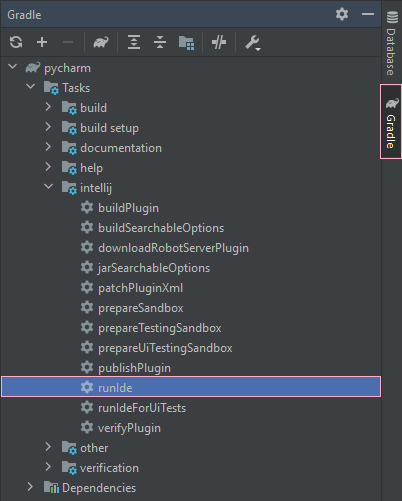
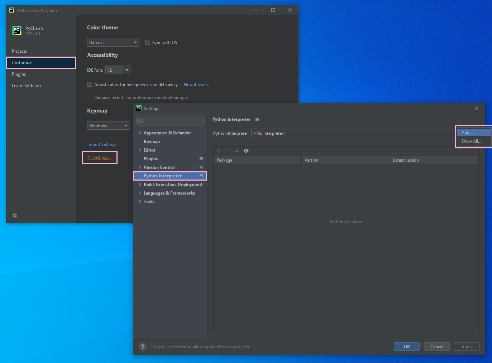
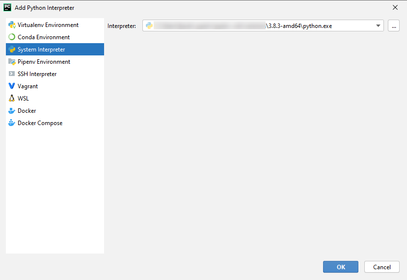
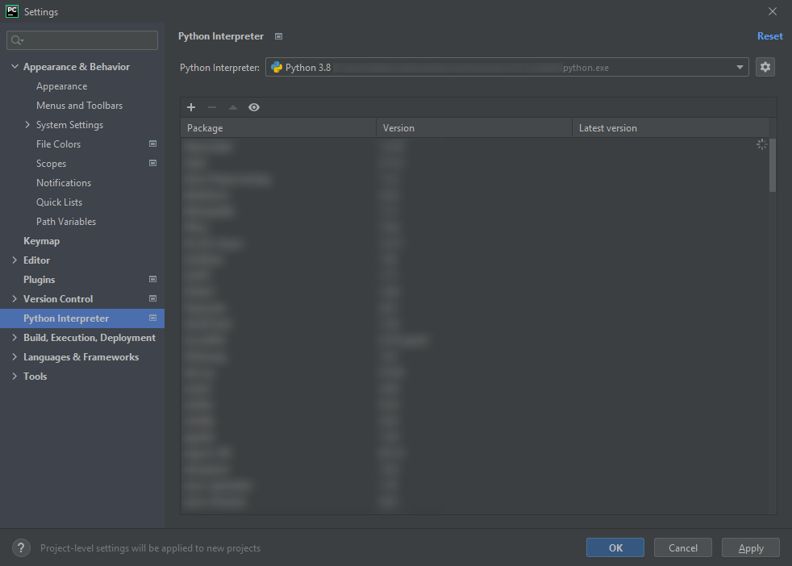

# PyNose: a Test Smell Detector for Python

PyNose is a test smell detector tool for Python. The tool can be run in two regimes:
in GUI mode (inside PyCharm IDE) and in CLI mode (from the command line). In this README,
we will describe both of these options.

## GUI Mode

The GUI mode can be used inside the IDE to study the test smells within a specific
opened project. This can help developers avoid test smells in their code.

1. The prebuilt version of the plugin can be found in the `PyNose-1.0-SNAPSHOT.zip`
   archive that comes with these sources.
2. Open PyCharm of version 2021.1.*.
3. In the `Settings`/`Preferences` dialog, select `Plugins`.
4. On the `Plugins` page, click the `Settings` button (in the shape of a gear) and then click `Install Plugin from Disk`.
5. Select the plugin archive file and click OK.
6. Click OK to apply the changes and restart the IDE if prompted.

Then, when you open a project in PyCharm, a `PyNose` panel will be available
on the right side of the screen that will list discovered test smells as is
shown in the screenshot.



## CLI Mode

The CLI mode can be useful for processing a large number of projects. In this
mode, PyCharm will be launched in the background, the project will be analyzed,
and all the results will be saved into JSON and CSV files. This regime is more difficult and hence 
requires a longer setup.

### Requirements

- IntelliJ IDEA (Community Edition or Ultimate);
- A modern Python 3 interpreter: Python 3.8 or newer;
- JDK 11.

### Download and Open Project

Open this project with IntelliJ IDEA in administrator/sudo mode.



Select the project in the pop-up window and open the project. The IDE will prompt detecting a Gradle project. Load this Gradle project by clicking `Load Gradle Project` option.



The IDE may also prompt that this is a project from the web. Click `Trust Project` to continue.



### Set up Python Interpreter

This tool will later launch PyCharm in the background to perform analysis. Before
this can happen, we need to set up the interpreter of this PyCharm.

Navigate to [`build.gradle`](./build.gradle) in the project root, select lines 27-37 and press ` Ctrl+/` (`Cmd+/` on macOS) to comment them out. The `intellij` section will look like this.

```groovy
// See https://github.com/JetBrains/gradle-intellij-plugin/
intellij {
    version '2021.1.1'
    type 'PC'
    downloadSources false
    plugins = ['PythonCore']
//    tasks {
//        runIde {
//            args(
//                    'pynose',
//                    project.hasProperty('myPath') ? myPath : '',
//                    project.hasProperty('myPython') ? myPython : '',
//                    project.hasProperty('myOutDir') ? myOutDir : ''
//            )
//            jvmArgs('-Djava.awt.headless=true')
//        }
//    }
}
```

Then, navigate to [`src/main/resources/META-INF/plugin.xml`](./src/main/resources/META-INF/plugin.xml), select line 17 and press `Ctrl+/` (`Cmd+/` on macOS) to comment it out. The `extensions` section will look like this.

```xml
<extensions defaultExtensionNs="com.intellij">
    <!-- Add your extensions here -->
    <toolWindow factoryClass="pynose.ui.PyNoseGUIFactory" id="PyNose" anchor="right" secondary="true" icon="AllIcons.Json.Object"/>
<!--        <appStarter implementation="pynose.PluginRunner"/>-->
</extensions>
```

After that, open the Gradle side panel, expand the list as shown below, and double click `runIde` to start PyCharm.



The PyCharm splash screen should appear. Now we need to set up Python interpreter for PyCharm. Click `Customize` and then `All settings...`.

Go to `Python Interpreter` section. If no interpreter is shown, click the top-right gear icon and choose `Add...` from its small pop-up menu.



You can just choose the existing system interpreter.



You should be able to see the interpreter as well as all its packages from PyPI in the `Python Interpreter` section. Remember the name of the Python interpreter. In our case, it is `Python 3.8`. We need to use this name later.



Click `OK` and then close the welcome screen. Now the Python interpreter is set up.

### Run the Tool for Test Smell Analysis

To run the tool, we now need to undo the two modifications to the code we have made above. Go back to the same two files
and uncomment the lines similarly to how you commented them.

After this, we need to make sure the command-line environment has JDK 11 configured. A sample check is shown here.

```
$ java -version

openjdk version "11.0.2" 2019-01-15
OpenJDK Runtime Environment 18.9 (build 11.0.2+9)
OpenJDK 64-Bit Server VM 18.9 (build 11.0.2+9, mixed mode)

$ javac -version
javac 11.0.2

# on Windows Command Prompt is echo %JAVA_HOME%
# on Windows PowerShell is echo $env:JAVA_HOME
$ echo $JAVA_HOME
/path/to/something/like/openjdk@1.11.0-2
```

Finally, we need to configure the analysis. Open the `runner.py` in the project root. We need to modify four variables.

- `DETECTOR_OUTPUT` stores the output of the tool. Make sure this folder exists before running the tool.
- `PLUGIN_ROOT` is the root of the detector project (i.e. the folder that contains `README.md` (this file), `runner.py`, and `build.gradle`).
- `REPO_PREFIX` is the folder containing all repositories that need to be analyzed. The detector will treat each folder inside this `REPO_PREFIX` as an individual repository.
- `PYTHON_INTERPRETER_NAME` is the name of the Python interpreter. Use the one shown in the last step of ["Set up Python Interpreter"](#set-up-python-interpreter) section (in our case it was `Python 3.8`).

Save and run this script. The script will then start the tool, you can watch the progress of the tool
by projects in the command line.

### Generate Test Smell Statistics

The previous step will generate a JSON with details for every file. If you want to aggregate
these JSONs into a single understandable CSV, you can run `get_csv_stats.py` to generate an aggregated statistics for all analyzed repositories. 
Remember to set `DETECTOR_OUTPUT` variable in this file. The resulting `aggregated.csv` will 
be saved in the same output folder and contain the number of smelly test suites for each
test smell in each project.
