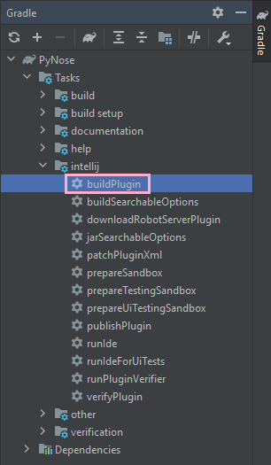

# PyCharm Test Smell Plugin

## Get Started

### Dependencies

- IntelliJ IDEA (Community Edition or Ultimate)
- A modern Python 3 interpreter like Python 3.8 or newer
- JDK 11

### Download and Open Project

After cloning this project, open it with IntelliJ IDEA.


Select the project in the pop-up window and open the project. The IDE will prompt detecting a Gradle project. Please load this Gradle project by clicking "Load Gradle Project" option.


The IDE may also prompt that this is a project from the web. Click "Trust Project" to continue.


### Set up Python Interpreter

Navigate to [`build.gradle`](./build.gradle) in the project root, select line 31-41 and press ` Ctrl+/` (`Cmd+/` on macOS) to comment them out. The `intellij` section will look like this.

```groovy
// See https://github.com/JetBrains/gradle-intellij-plugin/
intellij {
    version '2021.1.1'
    type 'PC'
    downloadSources false
    plugins = ['PythonCore']
//    tasks {
//        runIde {
//            args(
//                    'pynose',
//                    project.hasProperty('myPath') ? myPath : '',
//                    project.hasProperty('myPython') ? myPython : '',
//                    project.hasProperty('myOutDir') ? myOutDir : ''
//            )
//            jvmArgs('-Djava.awt.headless=true')
//        }
//    }
}
```

Then, navigate to [`src/main/resources/META-INF/plugin.xml`](./src/main/resources/META-INF/plugin.xml), select line 43 and press `Ctrl+/` (`Cmd+/` on macOS) to comment it out. The `extensions` section will look like this.

```xml
<extensions defaultExtensionNs="com.intellij">
    <!-- Add your extensions here -->
    <toolWindow factoryClass="pynose.ui.PyNoseGUIFactory" id="PyNose" anchor="right" secondary="true" icon="AllIcons.Json.Object"/>
    <appStarter implementation="pynose.PluginRunner"/>
</extensions>
```

After that, open the Gradle side panel, expand the list as shown below, and finally double click "runIde" to start the IDE.


The PyCharm splash screen should appear. Now we need to set up Python interpreter for PyCharm. Click "Customize" and then "All settings...".

Go to "Python Interpreter" section. If no interpreter is shown, click the top-right gear icon and choose "Add..." from its small pop-up menu.


You can just choose an existed system interpreter.


You should be able to see the interpreter as well as all its packages from PyPI in the "Python Interpreter" section. Remember the name of the Python interpreter. In my case, it is "Python 3.8". We need to use this name later.


Click "OK" and then close the welcome screen. Now the Python interpreter is set up.

## Command-line Mode

### Run the Tool for Test Smell Analysis

First, we need to undo the two modifications to the code we have done above. If you get this project by cloning with git, and you did not modify anything else, you can open a terminal, navigate to the project root, and type

```bash
git reset --hard HEAD
```

to undo the modification.

Then we need to make sure the command-line environment has JDK 11 configured. A sample check is shown here.

```
$ java -version

openjdk version "11.0.2" 2019-01-15
OpenJDK Runtime Environment 18.9 (build 11.0.2+9)
OpenJDK 64-Bit Server VM 18.9 (build 11.0.2+9, mixed mode)

$ javac -version
javac 11.0.2

# on Windows Command Prompt is echo %JAVA_HOME%
# on Windows PowerShell is echo $env:JAVA_HOME
$ echo $JAVA_HOME
/path/to/something/like/openjdk@1.11.0-2
```

Then open the `runner.py` in the project root. We need to modify four variables.

- `DETECTOR_OUTPUT` stores the output of the tool. Make sure it is existed before running the tool.
- `PLUGIN_ROOT` is the root of the detector project (i.e. the folder that contains `README.md` (this file), `runner.py`, and `build.gradle`).
- `REPO_PREFIX` is the folder containing all repositories that need to be analyzed. The detector will treat each folder inside this `REPO_PREFIX` as an individual repository.
- `PYTHON_INTERPRETER_NAME` is the name of the Python interpreter. Use the one shown in the last step of ["Set up Python Interpreter"](#set-up-python-interpreter) section (in my case it is "Python 3.8").

Just save and run this script. The script will then start the tool.

### Generate Test Smell Statistics

You can run `get_csv_stats.py` to generate an aggregated statistics for all analyzed repositories. Remember to set `DETECTOR_OUTPUT` variable in that file.

## GUI Mode

### Overview

PyNose will show a list of `.py` files and test cases where at least one test smell is detected. Here is a screenshot of the tool running with a real-world project in GUI mode.


### Debugging

Modifying [`build.gradle`](./build.gradle) and [`src/main/resources/META-INF/plugin.xml`](./src/main/resources/META-INF/plugin.xml), and then execute the "runIde" task, similar to the steps in the ["Set up License and Python"](#set-up-license-and-python) section. PyCharm will start, and you can use IntelliJ IDEA to see logs and debug the tool.

### Building as a Plugin

Run the "buildPlugin" task instead as shown below.



You can find the plugin at `build/distributions/PyNose-1.0-SNAPSHOT.zip` when the building process is done. Now you can install it into PyCharm. [This official tutorial](https://www.jetbrains.com/help/pycharm/managing-plugins.html#install_plugin_from_disk) may be helpful.


