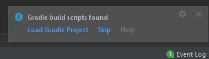
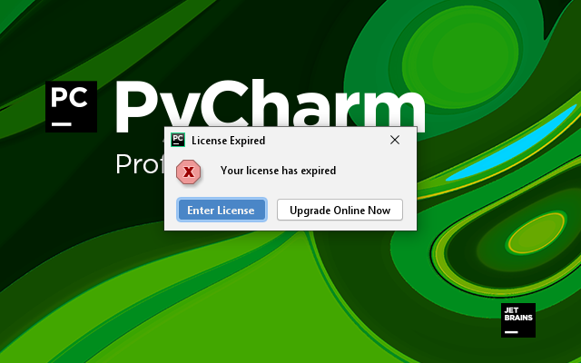
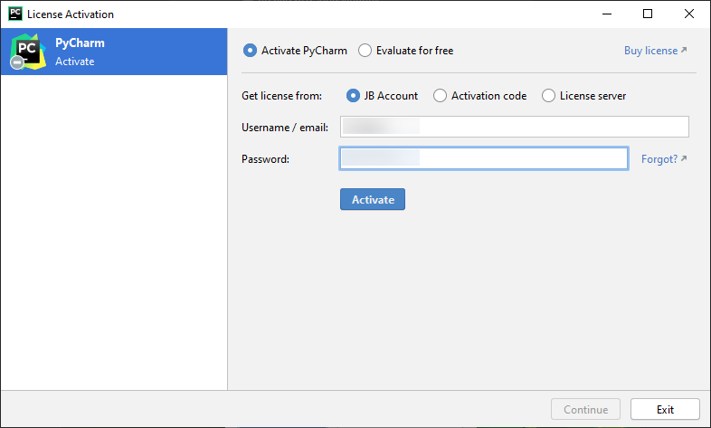
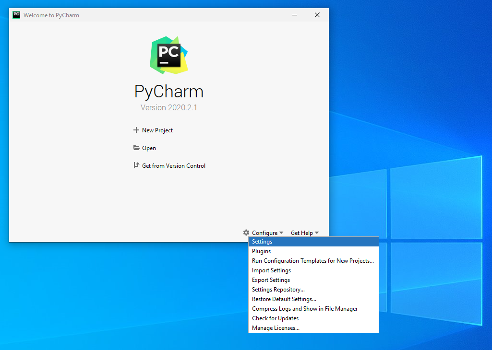
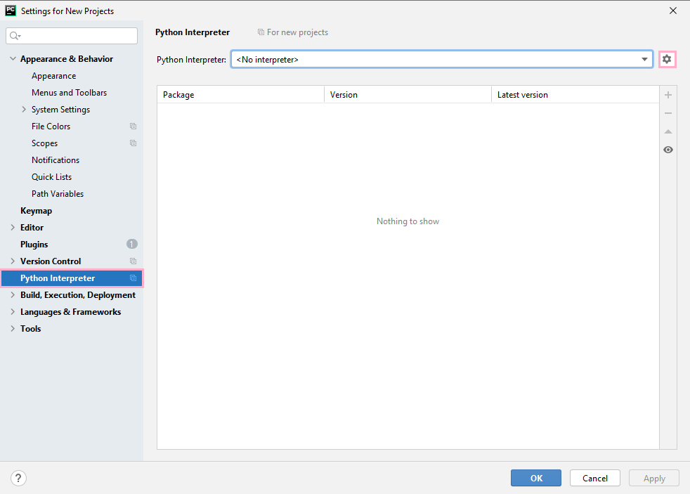
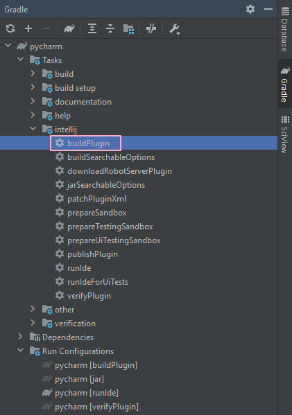
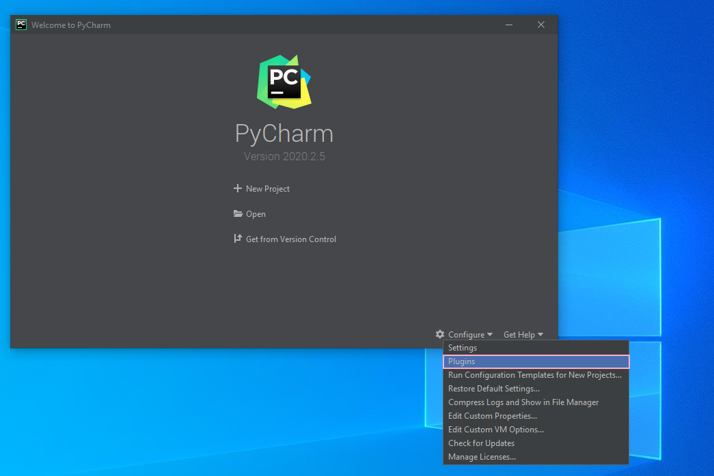
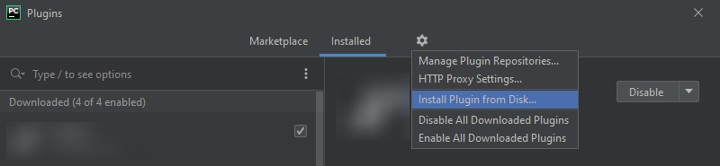
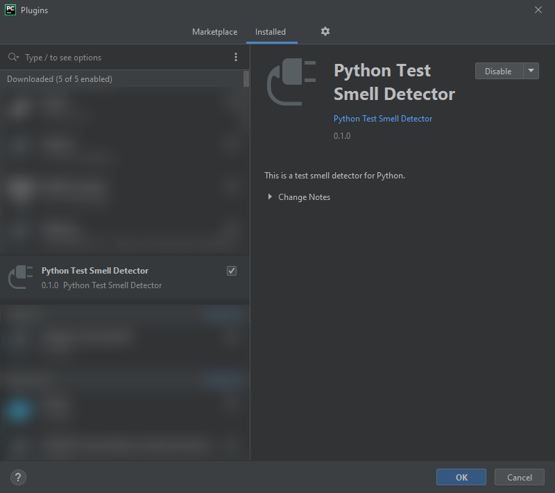
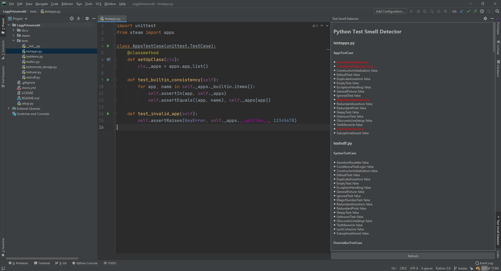

# PyCharm Test Smell Plugin

## Get Started

### Download and Open Project

After cloning this project, open it with IntelliJ IDEA.


Select the project in the pop-up window and open the project. The IDE will prompt detecting a Gradle project. Please load this Gradle project by clicking "Load Gradle Project" option.



The IDE may also prompt that this is a project from the web. Click "Trust Project" if you trust this project. You may need to check if JDK is 1.8 and manually install and set up it to be 1.8.


### Set up License and Python

Since this tool is developed in PyCharm Professional, a license is required. We have to modify some files in order to enter the license.

Navigate to [`build.gradle`](./build.gradle) in the project root, select line 31-41 and press ` Ctrl+/` (`Cmd+/` on macOS) to comment them out. The `intellij` section will look like this.

```groovy
// See https://github.com/JetBrains/gradle-intellij-plugin/
intellij {
    version = '2020.2.1'
    type = 'PY'
    downloadSources = false
    plugins 'Pythonid'
//    tasks {
//        runIde {
//            args(
//                    'test_smell',
//                    project.hasProperty('myPath') ? myPath : '',
//                    project.hasProperty('myPython') ? myPython : '',
//                    project.hasProperty('myOutDir') ? myOutDir : ''
//            )
//            jvmArgs('-Djava.awt.headless=true')
//        }
//    }
}
```

Then, navigate to [`src/main/resources/META-INF/plugin.xml`](./src/main/resources/META-INF/plugin.xml), select line 43 and press `Ctrl+/` (`Cmd+/` on macOS) to comment it out. The `extensions` section will look like this.

```xml
  <extensions defaultExtensionNs="com.intellij">
    <toolWindow id="Sample Calendar" secondary="true" icon="AllIcons.General.Modified" anchor="right"
                factoryClass="org.intellij.sdk.toolWindow.MyToolWindowFactory"/>
<!--    <appStarter implementation="PluginRunner"/>-->
  </extensions>
```

After that, open the Gradle side panel, expand the list as shown below, and finally double click "runIde" to start the IDE.


The PyCharm splash screen should appear, then an error about the license should appear. Click "Enter License" to continue.



If you have a JetBrains account, just enter the username and password and click "Activate". Otherwise, there are [free education licenses](https://www.jetbrains.com/community/education/#students) available.



When you see the welcome screen, it means you have successfully entered the license. Now we need to set up Python for PyCharm. Click "Configure" and then "Settings".



Go to "Python Interpreter" section. If no interpreter is shown, click the top-right gear icon and choose "Add..." from its small pop-up menu.



You can just choose an existed system interpreter.


You should be able to see the interpreter as well as all its packages from PyPI in the "Python Interpreter" section. Remember the name of the Python Interpreter. In my case, it is "Python 3.8". We need to use this name later.


Click "OK" and then close the welcome screen. Now the license and Python is set up.

## Commandline Mode

### Run the Tool for Test Smell Analysis

First, we need to undo the two modifications to the code we have done above. If you get this project by cloning with git, and you did not modify anything else, you can open a terminal, navigate to the project root, and type

```bash
git reset --hard HEAD
```

to undo the modification.

Then open the `runner.py` in the project root. We need to modify four variables.

- `DETECTOR_OUTPUT` stores the output of the tool. Make sure it is existed before running the tool.
- `PLUGIN_ROOT` is the root of the detector project (i.e. the folder that contains `runner.py` (this file) and `build.gradle`).
- `REPO_PREFIX` is the folder containing all repositories that need to be analyzed. The detector will treat each folder inside this `REPO_PREFIX` as an individual repository.
- `PYTHON_INTERPRETER_NAME` is the name of the Python interpreter. Use the one shown in the last step of ["Set up License and Python"](#set-up-license-and-python) section (in my case it is "Python 3.8").

Just save and run this script. The script will then start the tool.

### Generate Test Smell Statistics

You can run `get_csv_stats.py` to generate an aggregated statistics for all analyzed repositories. Remember to set `DETECTOR_OUTPUT` variable in that file.

## GUI Mode

### Debugging

Modifying [`build.gradle`](./build.gradle) and [`src/main/resources/META-INF/plugin.xml`](./src/main/resources/META-INF/plugin.xml), and then execute the "runIde" task, similar to the steps in the ["Set up License and Python"](#set-up-license-and-python) section. PyCharm will start, and you can use IntelliJ IDEA to see logs and debug the tool.

### Building as a Plugin

Run the "buildPlugin" task instead as shown below.



You can find the plugin at `build/distributions/pycharm-0.1.0.zip` when the building process is done.

Open PyCharm 2020.2.*, and go to "Configure" and then "Plugins" menu.



Click the gear icon at the top and then select "Install Plugin from Disk...".



Navigate to and then select the `.zip` file just generate. When you see the "PyNose" appears, it means the plugin is successfully installed (the icon may be different).



Click the "PyNose" in the bottom right corner, and you can see the tool listing all `.py` files and all test cases in it, with detected smells highlighted in red.


