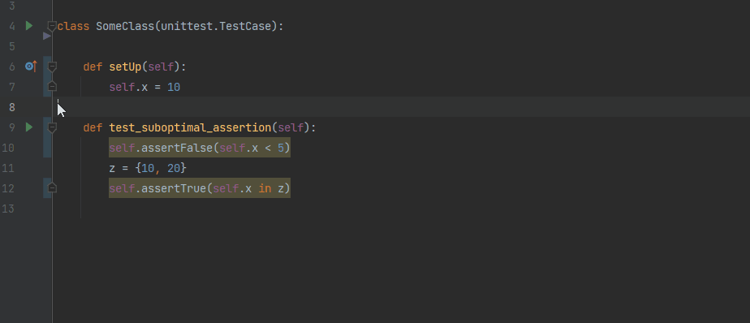
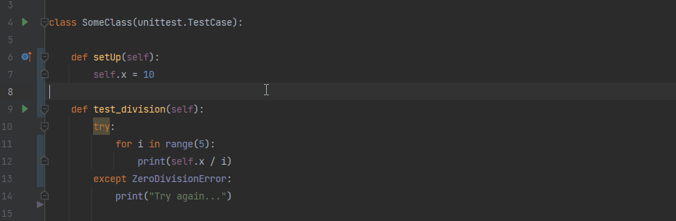

# PyNose: a Test Smell Detector for Python

PyNose is a test smell detector tool for Python. The tool runs inside PyCharm IDE.

## Description

PyNose can be used inside the IDE to study the test smells within a specific
opened project. This can help python developers avoid test smells in their code.

[comment]: <> (installation??)

When you open a project in PyCharm, a number of inspections will be available for usage.

Some inspections are initially disabled, however you can enable them from the settings.

## Available inspections

| Inspections                   |Unittest|Pytest |Quick fix                               |Warning level|Description|
| -------------                 |:------:|:-----:|:--------------------------------------:|:-----------:|:----------|
|Assertion Roulette             |+       |+      |-                                       |Disabled*    | A test case contains more than one assertion statement without an explanation|
|Conditional Test Logic         |+       |+      |-                                       |Disabled     | Presence of control statements (i.e., if, for, while)|
|Constructor Initialization     |+       |-      |+ (move logic to setup)                 |Weak warning | A test suite contains a constructor declaration (an \_\_init\_\_ method)|
|Default Test                   |+       |-      |+ (suggest rename refactoring)          |Weak warning | A test suite is called MyTestCase|
|Duplicate Assert               |+       |+      |+ (remove duplicate)                    |Warning      | Occurrence of more than one assertion statement with the same parameters|
|Empty Test                     |+       |+      |+ (safe delete)                         |Warning      | A test case does not contain a single executable statement|
|Exception Handling             |+       |+      |+ (replace with framework raise handler)|Warning      | Presence of either the try/except statement or the raise statement|
|Lack of Cohesion of Test Cases |+       |+      |-                                       |Disabled     | Test suites in a test case are not cohesive according to pairwise cosine similarities metric|
|Magic Number Test              |+       |+      |-                                       |Disabled     | Presence of an assertion statement with a numeric literal as an argument|
|Obscure In-Line Setup          |+       |+      |-                                       |Disabled     | A test case contains ten or more local variables declarations|
|Redundant Assertion            |+       |+      |+ (remove assertion)                    |Warning      | Presence of assertions the result of which never changes (i.e., assert 1 == 1)|
|Redundant Print                |+       |+      |+ (remove statement)                    |Disabled     | print() function invocation|
|Sleepy Test                    |+       |+      |+ (remove statement)                    |Disabled     | time.sleep() function invocation|
|Suboptimal Assert              |+       |-      |+ (replace with optimal)                |Warning      | Presence of one of the suboptimal asserts**|
|Test Maverick                  |+       |+      |-                                       |Disabled     | A test suite contains at least one test case that does not use a single field from the setup method|

*Disabled by default. If enabled - weak warning

**List of suboptimal assertions is available [here](https://zenodo.org/record/5156098)

## Usage examples

- Suboptimal assertion detection and quick fix
    
  
    

- Exception handling detection and quick fix
    
  
    
