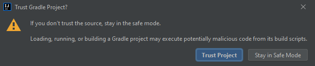

# PyNose: a Test Smell Detector for Python

PyNose is a test smell detector tool for Python.
It runs as a plugin inside the PyCharm IDE (version 2021.3)

**Note: PyNose is currently under active development, the older version of the tool that was initially described in the paper "PyNose: A Test Smell Detector For Python" can be found in the `ASE2021` branch.**

## How to use in PyCharm

1. Download the latest release of the plugin from [here](https://github.com/JetBrains-Research/PyNose/releases);
2. Open PyCharm and go to `File`/`Settings`/`Plugins`;
3. Select the gear icon, and choose `Install Plugin from Disk...`;
4. Choose the downloaded ZIP archive;
5. Click `Apply`;
6. Restart the IDE.

## Description

PyNose can be used inside the IDE to study the test smells within a specific
opened project. This can help python developers avoid test smells in their code.

When you open a project in PyCharm, a number of inspections will be available for usage.

PyNose will retrieve the information about your currently configured Test Runner (`Preferences > Tools > Python Integrated Tools > Testing > Default test runner`) to use the appropriate set of inspections (*pytest* or *Unittest*).

Some inspections are initially disabled, however you can enable them from the settings.

## Available inspections

| Inspections                   |Unittest|Pytest |Quick fix                               |Warning level|Description|
| -------------                 |:------:|:-----:|:--------------------------------------:|:-----------:|:----------|
|Assertion Roulette             |+       |+      |-                                       |Disabled*    | A test case contains more than one assertion statement without an explanation|
|Conditional Test Logic         |+       |+      |-                                       |Disabled     | Presence of control statements (i.e., if, for, while)|
|Constructor Initialization     |+       |-      |+ (move logic to setup)                 |Weak warning | A test suite contains a constructor declaration (an \_\_init\_\_ method)|
|Default Test                   |+       |-      |+ (suggest rename refactoring)          |Weak warning | A test suite is called MyTestCase|
|Duplicate Assert               |+       |+      |+ (remove duplicate)                    |Warning      | Occurrence of more than one assertion statement with the same parameters|
|Empty Test                     |+       |+      |+ (safe delete)                         |Warning      | A test case does not contain a single executable statement|
|Exception Handling             |+       |+      |+ (replace with framework raise handler)|Warning      | Presence of either the try/except statement or the raise statement|
|Lack of Cohesion of Test Cases |+       |+      |-                                       |Disabled     | Test suites in a test case are not cohesive according to pairwise cosine similarities metric|
|Magic Number Test              |+       |+      |-                                       |Disabled     | Presence of an assertion statement with a numeric literal as an argument|
|Obscure In-Line Setup          |+       |+      |-                                       |Disabled     | A test case contains ten or more local variables declarations|
|Redundant Assertion            |+       |+      |+ (remove assertion)                    |Warning      | Presence of assertions the result of which never changes (i.e., assert 1 == 1)|
|Redundant Print                |+       |+      |+ (remove statement)                    |Disabled     | print() function invocation|
|Sleepy Test                    |+       |+      |+ (remove statement)                    |Disabled     | time.sleep() function invocation|
|Suboptimal Assert              |+       |-      |+ (replace with optimal)                |Warning      | Presence of one of the suboptimal asserts**|
|Test Maverick                  |+       |+      |-                                       |Disabled     | A test suite contains at least one test case that does not use a single field from the setup method|

*Disabled by default. If enabled — weak warning.

**List of suboptimal assertions is available [here](https://zenodo.org/record/5156098).

## Usage examples

- Suboptimal assertion detection and quick fix
    
  
    

- Exception handling detection and quick fix
    
  
    

## Headless mode
The headless mode can be useful for processing a large number of projects. 
In this mode, PyCharm will be launched in the background, the project will be analyzed, 
and all the results will be saved to JSON and CSV files. 

### How to use in headless mode

Create a folder containing all the projects you want to analyse. 
Analysis will be performed for all the projects in a row.

Create an output directory, where all the `.csv` and `.json` files will be located
after the analysis.

Download this project: `git clone https://github.com/JetBrains-Research/PyNose`

Switch to headless mode branch: `git checkout headless-main`

#### Steps to run headless mode from IDE:

Open this project in PyCharm.

The IDE will prompt detecting a Gradle project.
Load this Gradle project by clicking `Load Gradle Project` option.

  

  

The IDE may also prompt that this is a project from the web. 
Click `Trust Project` to continue.

  

  

Open gradle side panel as shown below. 
Direct to `Tasks -> other` and choose the task called runCliHeadless. 

  

  

In the edit configuration window set arguments as shown below

  

  

## Contacts

If you have any questions or suggestions, don't hesitate to open an issue or contact Yaroslav Golubev at `yaroslav.golubev@jetbrains.com`.